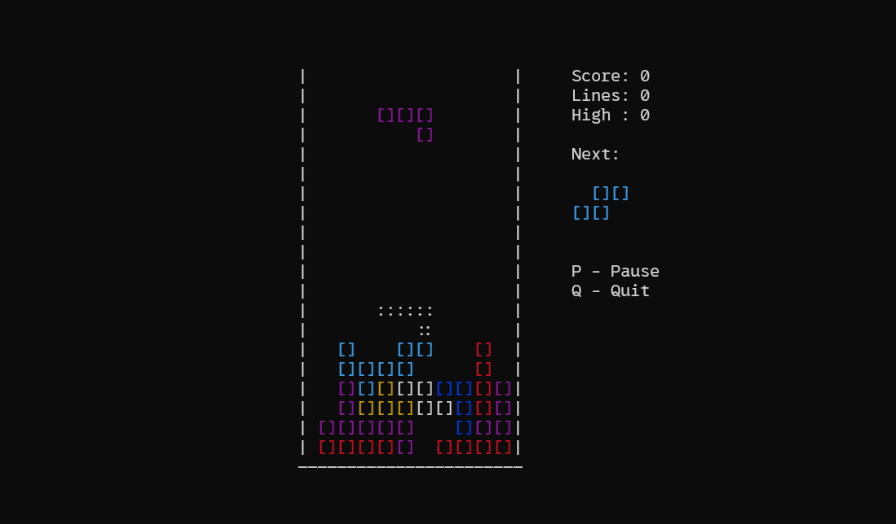

# 🕹️ terminal-tetris — A Classic Tetris Game in C (ncurses)

**terminal-tetris** is a lightweight and colorful command-line Tetris clone written entirely in **C** using the `ncurses` library.  
It brings the nostalgic gameplay of Tetris to your terminal — featuring smooth movement, ghost piece projection, scoring, and real-time controls.

---

## 🚀 Features

- 🎨 Colorful Tetrominoes (`I`, `O`, `T`, `L`, `J`, `S`, `Z`)  
- 💀 Ghost piece projection showing landing position  
- ⚙️ Smooth, real-time movement and rotation (no lag)  
- ⏸️ Pause, Resume, Restart, and Quit options  
- 🧮 Scoring system with increasing speed per level  
- 🧱 Auto-centered board for any terminal size  
- 🖥️ Works seamlessly on Linux, macOS, and Windows (via WSL)

---

## 🧩 Installation

Ensure you have a **C compiler** (like GCC) and the **ncurses** library installed.

### 🐧 Linux / Ubuntu
```bash
sudo apt update
sudo apt install gcc libncurses5-dev libncursesw5-dev
````

### 🍏 macOS

```bash
brew install ncurses
```

---

## ⚙️ Build Instructions

Clone and build the project:

```bash
git clone https://github.com/Gagandeeprai/terminal-tetris.git
cd terminal-tetris
gcc tetris_final.c -lncurses -o tetris
```

Run the game:

```bash
./tetris
```

---

## 🪟 Windows (WSL) Tip

If you're using **Windows Subsystem for Linux (WSL)**, you can compile and run the game easily:

```bash
# Go to your Windows Documents directory
cd /mnt/c/Users/<your-username>/Documents

# Build and run
gcc tetris_final.c -lncurses -o tetris
./tetris
```

✅ Works perfectly inside **Windows Terminal**
❌ Does **not** work in Command Prompt or PowerShell (no ncurses support)

---

## 🧠 Usage

Use your keyboard to control the falling Tetrominoes and clear lines.

```bash
← / → : Move piece left / right
↓      : Soft drop
↑      : Rotate clockwise
Space  : Hard drop (instantly land)
P      : Pause / Resume
Q      : Quit game
```

As you clear more lines, your score increases and the fall speed gradually accelerates — making the challenge harder.

---

## 🧪 Example Output

Used terminal gameplay:


Used terminal gameplay:




💀 The **ghost piece (::)** shows where your current piece will land —
helping you plan ahead for precise stacking.

---

## 🏗️ Project Structure

```
terminal-tetris/
│
├── tetris_final.c        # Main source file (game logic, rendering, input)
├── README.md             # Documentation file
└── .gitignore               # Optional, for compiled binary
```

---

## 💡 Tips

* Each cleared line = **+100 points**
* Speed increases automatically based on score
* Use **ghost piece (::)** for better positioning
* Use a terminal window ≥ **80x24** for optimal view
* Monospaced fonts make the visuals look cleaner

---

## 🧪 Tested On

| Platform               | Status        | Notes                      |
| ---------------------- | ------------- | -------------------------- |
| 🐧 Ubuntu 22.04        | ✅ Perfect     | Smooth performance         |
| 🍎 macOS 14 (M-series) | ✅ Perfect     | Works with default ncurses |
| 🪟 WSL2 + Ubuntu       | ✅ Perfect     | Use Windows Terminal       |
| 🪟 CMD / PowerShell    | ❌ Unsupported | No ncurses rendering       |
| 📱 Termux (Android)    | ⚠️ Works      | Arrow key mapping may vary |

---

## 🧑‍💻 Author

### **Gagandeep Rai**

Developed while learning **C programming**, **data structures**, and **game loop design**.
The project was built step-by-step with **ChatGPT (GPT-5)** guidance to understand real-time terminal rendering, keyboard input handling, and collision logic.

---

## 📜 License

MIT License — free for personal, educational, and commercial use.

---
